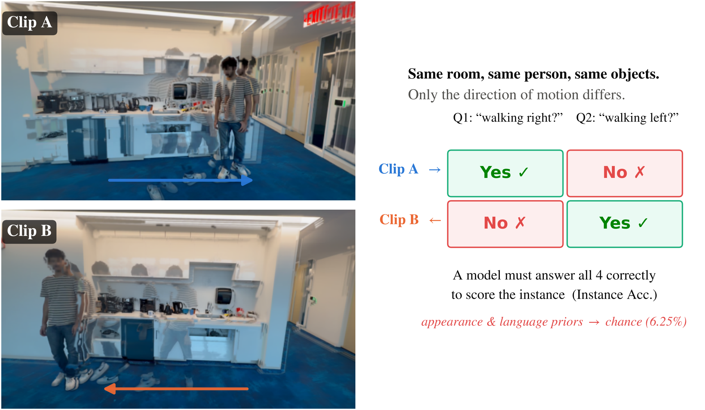
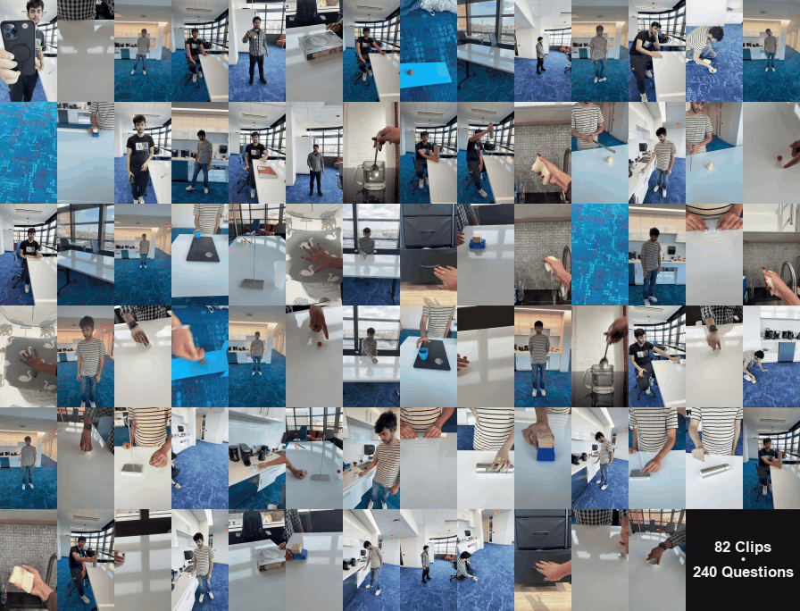
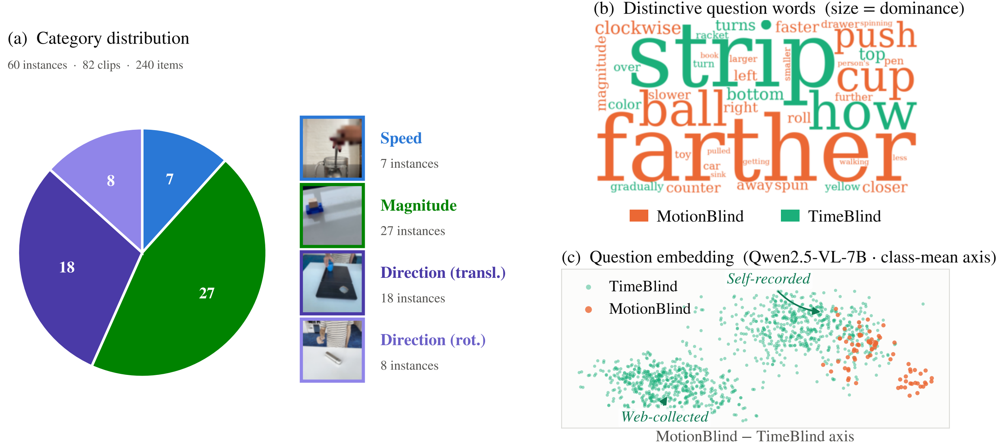

# MotionBlind: Probing the Illusion of Motion Understanding in Video-LLMs

[](https://arxiv.org/)
[](https://huggingface.co/datasets/augmentedcognitionlab/MotionBlind)
[](LICENSE)
[](https://ostadabbas.github.io/motionblind.github.io/)

Code and data for the paper *MotionBlind: Probing the Illusion of Motion Understanding in
Video-LLMs*
(NeurIPS 2026 Workshop on World Models in Physical AI, under review).

<p align="center">
  
  
</p>

<p align="center">
  <a href="#overview">Overview</a> ·
  <a href="#benchmark-suite">Benchmark Suite</a> ·
  <a href="#installation">Installation</a> ·
  <a href="#running-an-evaluation">Running an Evaluation</a> ·
  <a href="#metrics">Metrics</a> ·
  <a href="#citation-and-license">Citation</a>
</p>

## Overview

<p align="center">
  
</p>

**MotionBlind** is a contrastive benchmark of self-recorded video for motion understanding
(speed, magnitude, direction). Each instance pairs two clips that differ only in motion; each
clip carries two `yes/no` questions, and a model scores the instance only if all four answers
are correct (`I_Acc`, chance 6.25%).

- Open models sit near the chance floor (best: 11.7% `I_Acc`); scale does not help.
- No video: 0%. Shuffled or reversed frames: chance. The task needs ordered video.
- More frames and smarter frame selection do not help.
- Gemini 3.1 Pro reaches 60.0%; the human ceiling is 91.3%.
- The same open models score 52 to 59% `Acc` and 58 to 70% on Video-MME.

The repository contains the benchmark (240 questions, 82 clips), the frozen-model harness, the
order and no-video probes, and a Video-MME control.

## Benchmark Suite

| Set | Instances | Videos | Items | Format | Role |
| --- | ---: | ---: | ---: | --- | --- |
| **MotionBlind** (ours) | 60 | 82 | 240 | `yes_no`, 120 yes / 120 no | primary; physically grounded motion |
| **TimeBlind** | 600 | 1200 | 2400 | 1200 `yes_no` + 1200 2-way MC, disjoint videos | contrastive reference, internet video |
| **Video-MME** | - | 900 | 2700 | 4-way MC, 3 questions per video | non-contrastive control |

MotionBlind and TimeBlind form one 2,640-question contrastive suite. Video-MME is a
non-contrastive control; only `Acc` is defined there.

Categories by instance count: magnitude (27), translational direction (18), rotational
direction (8), speed (7). Clip reuse gives 82 unique videos.

Each `data.jsonl` row carries `index`, `video_path`, `question`, `answer`, and `type`.
Instances are consecutive groups of four rows (`index // 4`) ordered `q0_i0`, `q0_i1`,
`q1_i0`, `q1_i1`.

## Installation

```bash
conda create -n motionblind python=3.11 -y && conda activate motionblind
pip install "torch==2.6.0" "torchvision==0.21.0" --index-url https://download.pytorch.org/whl/cu124
pip install -r requirements.txt
```

Optional, for learned frame selection:

```bash
git clone https://github.com/ostadabbas/HORNet.git   # used via --sampling hornet
```

### Model weights

All models run **frozen**. Pull the weights once:

```bash
export HF_HOME=$SCRATCH/hf_cache
huggingface-cli download nvidia/Eagle2.5-8B
huggingface-cli download Qwen/Qwen3-VL-4B-Instruct
huggingface-cli download bishoygaloaa/motion-o
huggingface-cli download allenai/Molmo2-8B
huggingface-cli download google/gemma-4-12B-it
```

**Run locally:**

| Model | Entry point |
| --- | --- |
| Eagle2.5-8B | `src/eval/eval_eagle.py` |
| Qwen3-VL-4B-Instruct | `src/eval/eval_qwen3.py` |
| Motion-o (Qwen2.5-VL-7B ft) | `src/eval/eval_motion.py` |
| Molmo2-8B | `src/eval/eval_molmo2.py` |
| Gemma-4-12B-it | `src/eval/eval_gemma4.py` |
| Inkling-Small | `src/eval/eval_inkling.py` |

**Frontier APIs:**

| Model | Entry point |
| --- | --- |
| Gemini 3.1 Pro | `src/eval/eval_gemini.py` |
| GPT-5.6-luna | `src/eval/eval_openai.py` |

## Running an Evaluation

### Basic

```bash
python src/eval/eval_eagle.py \
  --base-path data --data data/data.jsonl \
  --sampling uniform --num-frames 16 --prompt-template default \
  --out results/eagle2_5_8b_mbhuman_uniform16.json
```

Omit `--out` and the driver derives the repository naming convention and prints it.

### Evaluate your own model

```bash
python src/eval/examples/evaluate_your_model.py    # runs as-is with a stub model
```

Edit part 2 only. Replace `load_model()` and `predict()` with your inference;
the comments contain a complete Eagle implementation. The scores print at the
end. The output JSON holds one row per question: the question, the raw model
text, the extracted answer, the gold answer, and correct or not.

### Rescore

Any stored prediction file can be rescored later:

```bash
python src/eval/lib/report_run_metrics.py results/eagle2_5_8b_mbhuman_uniform16.json --data data/data.jsonl
```

The tables in `results/` are the paper's. `src/analysis/make_tables.py` regenerates
them from the committed per-question runs.

### Shared flags

Every driver takes the same core interface.

| Flag | Meaning |
| --- | --- |
| `--model` | checkpoint or model id (default: the paper's) |
| `--data` | benchmark jsonl (default: the in-repo MotionBlind set) |
| `--base-path` | root that `video_path` values join onto |
| `--out` | predictions JSON; omit it and the naming convention is derived |
| `--sampling` | `uniform`, `random`, `hornet`, `f2cfull` on every model |
| `--num-frames` | frames per video: 1, 4, 8, 16, 24 |
| `--seed` | drives `random` sampling and the `shuffled_frames` permutation |
| `--ablation` | `none`, `shuffled_frames`, `reversed_frames`, `no_video` |
| `--prompt-template` | `default` or `cot` |
| `--max-samples` | truncate the item list, for smoke tests |

### Diagnostic probes

```bash
# no video: question only, no frames
python src/eval/eval_eagle.py ... --ablation no_video

# shuffled frames: identical frames, shuffled order
python src/eval/eval_eagle.py ... --sampling uniform --num-frames 16 --ablation shuffled_frames

# reversed frames: same frames, time reversed
python src/eval/eval_eagle.py ... --sampling uniform --num-frames 16 --ablation reversed_frames
```

### Video-MME

The 101 GB release is never downloaded. Build the question file once. The drivers then
stream each needed clip out of the Hub zips into a size-capped cache:

```bash
python src/eval/lib/prep_videomme.py --hf-videos    # -> videomme/data.jsonl
```

MotionBlind and TimeBlind need no preparation step. Both ship `data.jsonl` in the
same shape, and every driver loads either file unchanged.

## Metrics

| Metric | Credit unit | Denominator | Chance |
| --- | --- | ---: | ---: |
| `Acc` | one `yes/no` item | 240 | 50% |
| `Q_Acc` | one question, correct on **both** videos | 120 | 25% |
| `V_Acc` | one video, correct on **both** questions | 120 | 25% |
| **`I_Acc`** | one instance, **all four** items correct | 60 | 6.25% |

`I_Acc` is primary. The set is label-balanced: a constant-answer model scores `Acc = 50%` but
`I_Acc = 0%`. Every run also reports the yes-rate and F1; unparseable outputs count as
incorrect. Comparisons use a paired exact McNemar test over shared instances.

Video-MME is 4-way multiple choice with no pairing; only `Acc` is defined there. Chance is
25.0%; the majority-class baseline is 27.2%.

## Citation and License

```bibtex
@inproceedings{anonymous2026motionblind,
  title     = {MotionBlind: Probing the Illusion of Motion Understanding in Video-LLMs},
  author    = {Anonymous},
  booktitle = {NeurIPS 2026 Workshop on World Models in Physical AI},
  year      = {2026},
  note      = {Under review}
}
```

Please also cite the benchmark this work builds on:

```bibtex
@article{li2026timeblind,
  title  = {TimeBlind: Evaluating Spatio-Temporal Compositionality in Video-Language Models},
  author = {Li, Baiqi and Zhao, Kangyi and Zhang, Ce and Mitra, Chancharik and
            Nyandwi, Jean de Dieu and Bertasius, Gedas},
  year   = {2026}
}
```

Released under the terms in [LICENSE](LICENSE).

## Acknowledgments

- **TimeBlind** (Li et al.) for the benchmark, dataset, and the scorer that ships here as
  `src/eval/lib/scoring.py`.
- **HORNet** for the GRPO-trained frame selector evaluated here.
- **Video-MME** (Fu et al.) for the non-contrastive control benchmark.
- The **Eagle**, **Qwen-VL**, **Molmo**, **Gemma**, and **Motion-o** teams for the open weights.
- Compute provided by an institutional research cluster.
